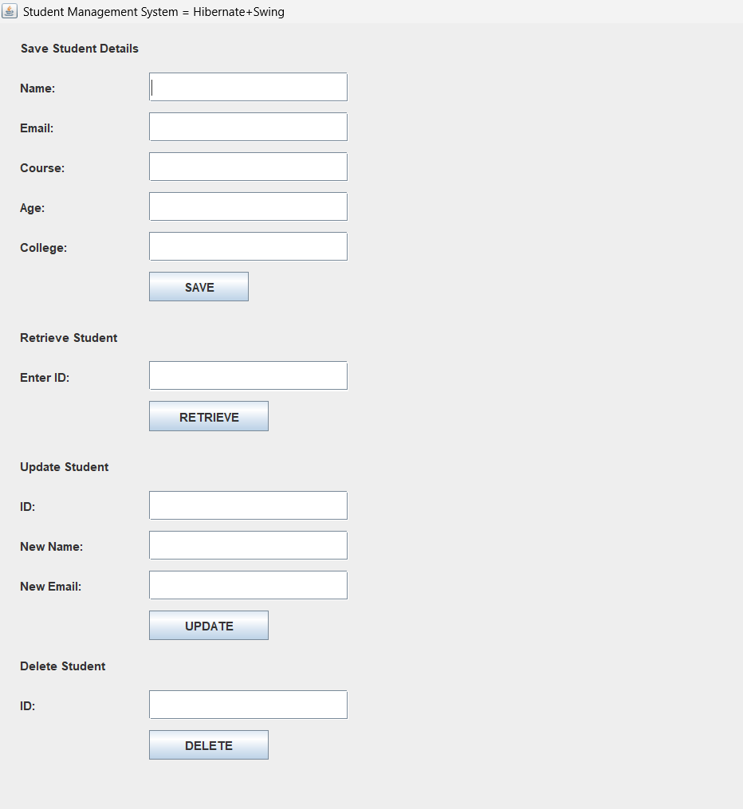
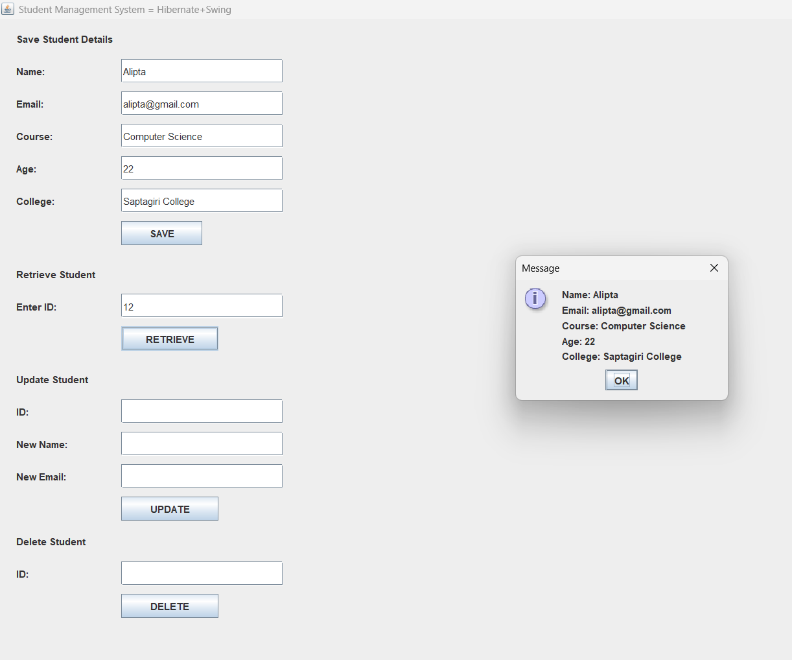
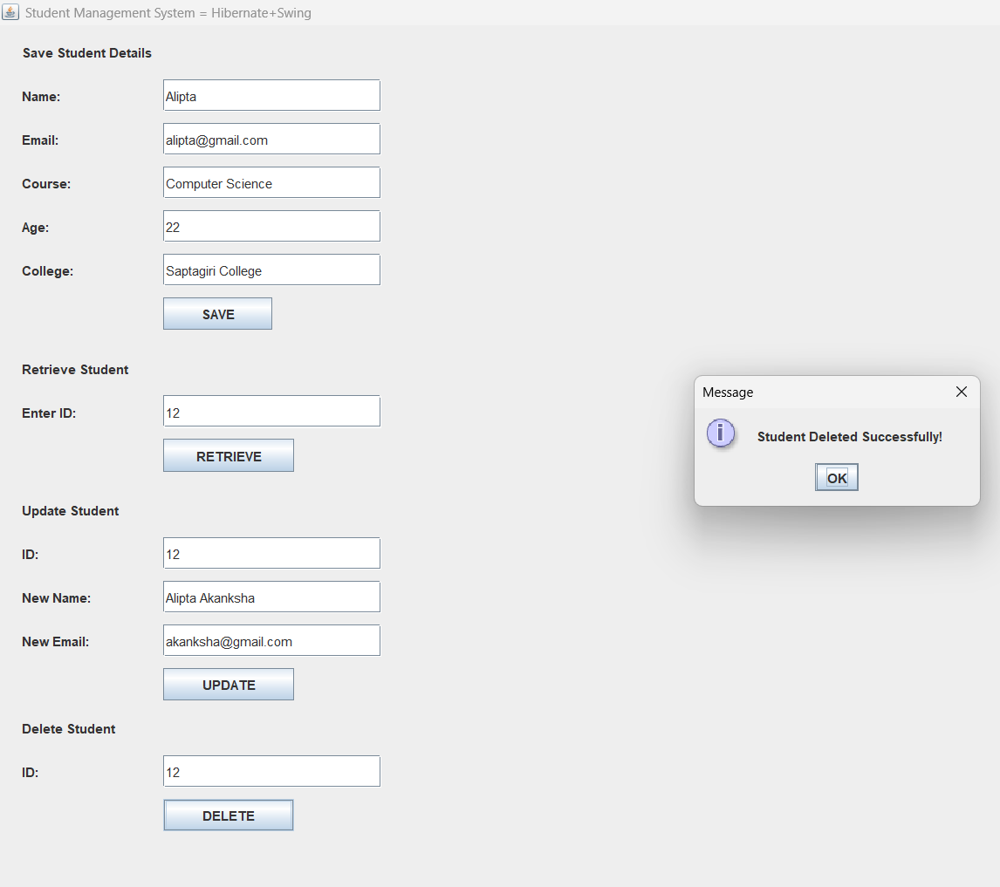

# Student Management System using Hibernate and Java Swing

## Description
A desktop-based Student Management System built using Java Swing for UI
and Hibernate ORM for database operations. The application supports full
CRUD operations to manage student records efficiently.

## Problem Statement
Manual handling of student data is inefficient and error-prone. This
project provides a structured and database-backed solution to create,
read, update, and delete student information through a user-friendly
desktop application.

## Features
- Add new student details
- View all student records
- Update student information
- Delete student records
- Hibernate-based persistence
- Layered architecture

## Tech Stack
- Java
- Java Swing
- Hibernate ORM
- MySQL
- Maven

## Architecture
- UI Layer: Java Swing
- Service Layer: Business logic
- DAO Layer: Hibernate-based CRUD operations
- Model Layer: Entity classes
- Database: MySQL

## Screenshots

### Home Screen

### Add Student
.png)
.png)

### View / Retrieve Students

### Update Student
.png)
.png)

### Delete Student

